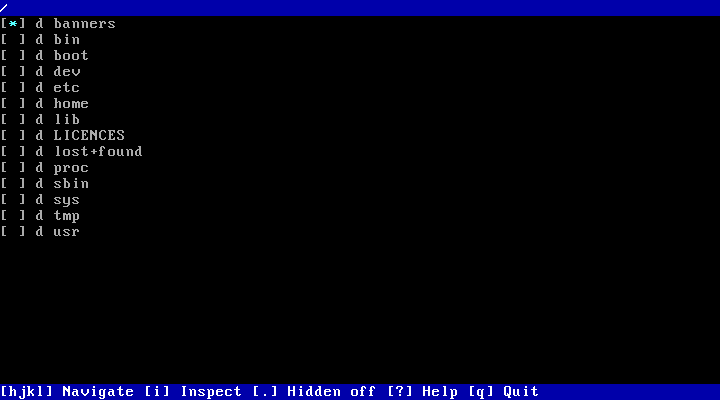
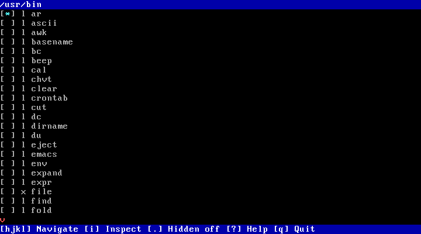
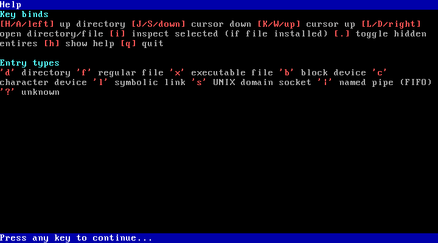
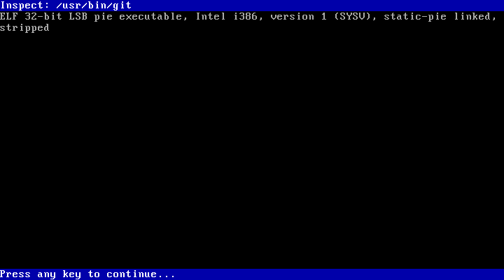
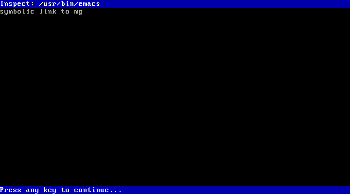
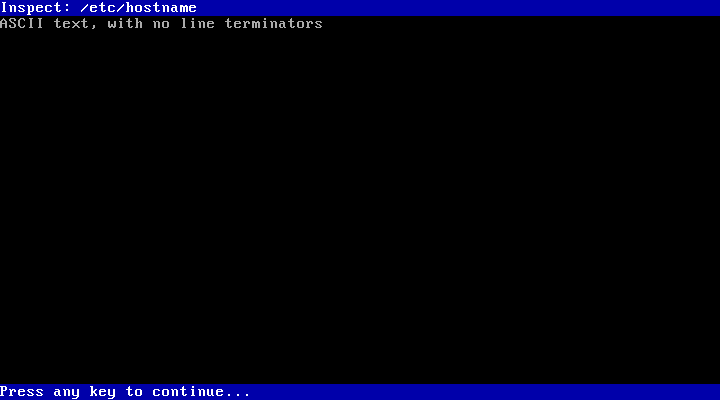

# shorkdir

A lightweight Linux terminal-based file browser. It is designed to provide simple directory browsing and navigation, and provided `file` is installed, it can also identify and describe a selected file. It is primarily written for use with SHORK family operating systems like [SHORK 486](https://github.com/SharktasticA/SHORK-486), designed to be minimal and not taxing on 486-era hardware, and is statically linked. But it should work on modern Linux distributions just fine.

## Issues

shorkdir can produce flickering on some hardware/terminal emulations, usually on older/slower hardware. shorkdir will soon be modified to only redraw what is needed instead of always redrawing everything.

## Building

### Requirements

You just need a C compiler (tested with GCC and i486-linux-musl-cross)

### Compilation

Simply run `make`

### Installation

Run `make install` to install to `/usr/bin` (you may need `sudo` if not installing as root). If you want to install it elsewhere, you can override the install location prefix like `make PREFIX=/usr/local install`.

## Running

Simply run `shorkdir` to use. Press "?" to get a list of key binds and directory entry type guide. 

When running, you are technically running a bootstrap shell script, required for changing the current directory once the program exits. `shorkdir-exec` is binary itself, which can be run directly if changing directory upon exiting is not desired.

## Screenshots

<table style="table-layout: fixed; width: 100%;">
  <tr>
    <td style="width: 50%; text-align: center;"></td>
    <td style="width: 50%; text-align: center;"></td>
  </tr>
  <tr>
    <td style="width: 50%;">Browsing root directory</td>
    <td style="width: 50%;">Browsing /usr/bin</td>
  </tr>
</table>

<table style="table-layout: fixed; width: 100%;">
  <tr>
    <td style="width: 50%; text-align: center;"></td>
    <td style="width: 50%; text-align: center;"></td>
  </tr>
  <tr>
    <td style="width: 50%;">Help screen</td>
    <td style="width: 50%;">Select editor screen</td>
  </tr>
</table>

<table style="table-layout: fixed; width: 100%;">
  <tr>
    <td style="width: 50%; text-align: center;"></td>
    <td style="width: 50%; text-align: center;"></td>
  </tr>
  <tr>
    <td style="width: 50%;">Inspect screen (executable example)</td>
    <td style="width: 50%;">Inspect screen (symbolic link example)</td>
  </tr>
</table>

<table style="table-layout: fixed; width: 50%;">
  <tr>
    <td style="width: 50%; text-align: center;"></td>
  </tr>
  <tr>
    <td style="width: 50%;">Inspect screen (text file example)</td>
  </tr>
</table>
